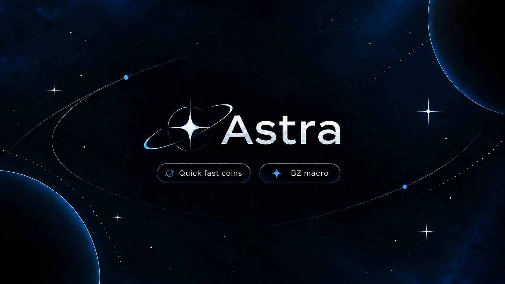

  

<h1 align="center">Astra</h1>

Your Bazaar trading dashboard. Windows or Linux.

<a href="https://astra-client.com">Website</a> · <a href="https://github.com/FihGod/Astra-Releases/releases/latest">Latest release</a> · <a href="https://discord.com/channels/1545695308564930580/1545701338699145236/1552846663150731421">Setup guide</a>

## Download

| Windows | Linux VPS |
| :--- | :--- |
| [**Download Astra for Windows**](https://github.com/FihGod/Astra-Releases/releases/latest/download/Fish-Flipper.exe) | [**Download the Linux installer**](https://github.com/FihGod/Astra-Releases/releases/latest/download/install-linux.sh) |
| Run the app and follow the setup prompts. | Ubuntu on Intel/AMD x86-64. |

An active Astra license and a Microsoft account with Minecraft Java access are required. Purchase and manage access at [astra-client.com](https://astra-client.com).

## Get started

**Windows** — Download the EXE, set up your dashboard password, add your license and Microsoft account, then review your settings before starting.

**Linux** — Download and inspect the installer above, then run it on your VPS. Follow the [Discord setup guide](https://discord.com/channels/1545695308564930580/1545701338699145236/1552846663150731421). Use HTTPS or a private VPN for remote dashboard access.

## Updates you can verify

Official release files are accompanied by signed metadata: **ff-release.json** and **ff-release.sig**. Use the built-in updater or downloads from this repository. Some filenames retain the former Fish Flipper name for compatibility.

## Support

Use the Astra Discord support tickets for billing, login, bugs, ban appeals, or general help. Never post license keys, passwords, Microsoft login codes, or raw account backups in public issues.

This repository distributes Astra releases; it does not contain the private application source. Software use is subject to the terms on the [Astra website](https://astra-client.com). Game automation can violate server rules; bans and losses are possible.
